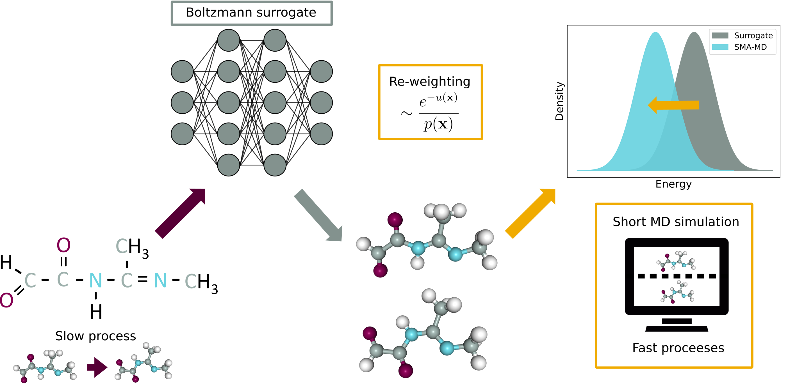

# SMA-MD: Surrogate Model-Assited Molecular Dynamics



## Description
SMA-MD is a procedure for sampling the conformational space of molecules. SMA-MD first leverages Deep Generative Models to enhance the sampling of slow degrees of freedom. Then, the generated ensemble undergoes statistical reweighting, followed by short simulations.

## Updates
The following versions of SMA-MD exist in this repository:
* v1.b is the label corresponding to the first beta version.


## Prerequisites
* Anaconda or Miniconda with Python 3.9.
* CUDA-enabled GPU.

### Setting the environment
SMA-MD uses two conda environments, e3nn-env and openmm-env. e3nn-env is used for training and sampling the generative model and openmm-env is used for molecular dynamics related tasks. The environments have complicated deppendencies, and direct installation can take long time. Therefore, we recommend following the installation steps as described below.

To set up e3nn-env, use [./environments/e3nn-env.yml](./environments/e3nn-env.yml) and run:

```
conda env create -f environments/e3nn-env.yml
conda activate e3nn-env.yml
pip3 install torch torchvision torchaudio
pip install torch_geometric
pip install pyg_lib torch_scatter torch_sparse torch_cluster torch_spline_conv -f https://data.pyg.org/whl/torch-2.1.0+cu121.html
pip install rdkit=2022.09.4 seaborn mdtraj pyaml networkx h5py e3nn
```

To set up openmm-env, use [./environments/openmm-env.yml](./environments/openmm-env.yml) and run: 
```
conda env create -f environments/openmm-env.yml
conda activate new-openmm-env
conda install pytorch==1.12.1 torchvision==0.13.1  -c conda-forge
conda install rdkit=2022.09.4 seaborn mdtraj notebook nglview h5py -c conda-forge
conda install ipywidgets==7.7 -c conda-forge
```

Then, in the SMA-MD directory
```
cd reform
pip install .
```

### Usage
The surrogate model (torsional diffusion) can be trained with the script [train.py](./train.py) using e3nn-env. Sampling from a trained model can be done with [sample.py](./sample.py) using e3nn-env. For a complete sampling procedure, ones needs to also run [energy_evaluation.py](./energy_evaluation.py) and [md_finetuning.py](./md_finetuning.py) with the openmm-env.

The (hyper-)parameters and dataset paths/indexes can be specified at [./parameters.py](./parameters.py).

## Data
The MDQM9-nc dataset is available at [https://github.com/olsson-group/mdqm9-nc-loaders](https://github.com/olsson-group/mdqm9-nc-loaders). It contains mdqm9-nc.sdf, a sdf file with the molecules, mdqm9-nc.hdf5 with conformational data. Random splits are also provided.

## Contributors
[@JuanViguera](https://www.github.com/JuanViguera) and [@psolsson](https://github.com/psolsson).

## Contributions
Contributions are welcome in the form of issues or pull requests. To report a bug, please submit an issue. Thank you to everyone who has used the code and provided feedback thus far.

### Publications
If you use SMA-MD in your research, please reference our [paper](https://doi.org/10.26434/chemrxiv-2023-sx61w).

The reference in BibTex format are available below:

```
 @article{viguera diez_romeo atance_engkvist_olsson_2023, place={Cambridge}, title={Generation of conformational ensembles of small molecules via Surrogate Model-Assisted Molecular Dynamics}, DOI={10.26434/chemrxiv-2023-sx61w}, journal={ChemRxiv}, publisher={Cambridge Open Engage}, author={Viguera Diez, Juan and Romeo Atance, Sara and Engkvist, Ola and Olsson, Simon}, year={2023}} This content is a preprint and has not been peer-reviewed.
```

### Related work
```
@misc{jing2023torsional,
      title={Torsional Diffusion for Molecular Conformer Generation}, 
      author={Bowen Jing and Gabriele Corso and Jeffrey Chang and Regina Barzilay and Tommi Jaakkola},
      year={2023},
      eprint={2206.01729},
      archivePrefix={arXiv},
      primaryClass={physics.chem-ph}
}

@Article {Boltzmann_gen,
	author = {No{\'e}, Frank and Olsson, Simon and K{\"o}hler, Jonas and Wu, Hao},
	title = {Boltzmann generators: Sampling equilibrium states of many-body systems with deep learning},
	volume = {365},
	number = {6457},
	elocation-id = {eaaw1147},
	year = {2019},
	doi = {10.1126/science.aaw1147},
	publisher = {American Association for the Advancement of Science},
	issn = {0036-8075},
	URL = {https://science.sciencemag.org/content/365/6457/eaaw1147},
	eprint = {https://science.sciencemag.org/content/365/6457/eaaw1147.full.pdf},
	journal = {Science}
}
```

## License
SMA-MD is licensed under the MIT license and is free and provided as-is.

## Link
[https://github.com/olsson-group/sma-md](https://github.com/olsson-group/sma-md)
